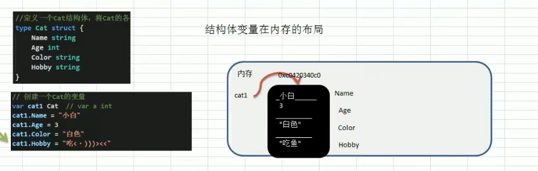

### 指针：

### 值类型和引用类型

- 引用传递效率高

### 值传递函数调用过程

### 指针传递函数调用过程

### 函数类型用法

~~~go
package main
import "fmt"

//函数也是一种数据类型，通过type申明函数类型，只是能为了给函数类型传参
type myf func(int ,int) int

//传入myf栈
func testM(my myf,i1,i2 int)  {
    //执行myf栈
	fmt.Println(my(i1,i2 ))
}
//该方法符合myf类型
func ww(i1 ,i2 int) int {
	return i1+ i2
}
func main() {
	testM(ww,1,2)
}

~~~

### defer

defer栈先进后出，并把当时的值压入栈中

~~~go

func main() {
	v := 2
	v2 := 3
	defer fmt.Println(v)  //4     输出2
	defer fmt.Println(v2) //3     输出3
	v++
	v2++				//执行顺序
	fmt.Println(v)      //1    	  输出3
	fmt.Println(v2)		//2	      输出4
}
~~~

### new

用于分配内部，主要用于分配值类型

### 异常处理机制

defer  + recover 配合使用

~~~go
package main

import "fmt"

func test()  {
	defer func() {
		err := recover()   //负责接收函数内的所有错误，判断是否有收到错误
		if err != nil {
			fmt.Println(111,err)
		}
	}()
	a := 10
	b := 0
	nun := a/b    //此時出現panic，并將错误传给recover
	println(nun)
}

func main() {
	test()
	fmt.Println(1111)  //引发panic后还可以继续执行该代码
}
~~~

### 数组内存分配

### 切片

#### 截取数据内存分布

#### make创建切片内存分布

### string与slice与byte的关系

### string修改

~~~go
	s := "qqqq"
	bs := []byte(s)
	bs[2] ='w'
	s = string(bs)
	fmt.Printf(s)
~~~

### map

- 使用map前需要make申请空间

~~~go
m := make(map[string]string)  ,默认分配一个空间，并会自动增长

~~~

### 结构体

- 结构体的值在内存中是连接的

#### 值类型内存分布

#### 引用类型内存分布

#### 结构体显示转换要求

- 成员个数，成员名称，成员类型都必须相同，三者缺一不可

~~~go
type A struct {
	NUB int
}

type B struct {
	NUB int
}

func main() {
	a := A{}
	b := B{}
	a = A(b)    //个数，名称，类型相同，可转换成功
	fmt.Println(a)
}

~~~

#### 结构体方法调用内存分布

- 方法调用和函数机制一样
- 结构体调用时，也会将自身拷贝到对应的方法栈中

#### 结构体实现String方法

~~~go
type A struct {
	NUB int
}

func (a A) String() string {  
	return fmt.Sprintf("{NUB = %d}",a.NUB)
}

func main() {
	a := A{
		1,
	}
	fmt.Println(a)  //此处自动String方法
}

~~~

#### 结构体的值方法和指针方法

~~~go
type A struct {
	NUB int
}

func (a A) name1() {
	a.NUB = 2
}

func (a *A) name()  {
	a.NUB = 3
}

func main() {
	a := A{1}   //创建一个值类型
	a.name1()		//调用一个值方法，在name1栈中的a属于值拷贝
	fmt.Println(a.NUB)
	a.name()   		//调用一个指针方法，在name栈中的a属于指针拷贝
	fmt.Println(a.NUB)
}

~~~

#### 继承语法

~~~go
package main

import "fmt"

type A struct {
	NUB int
}

func(a A)getN()  {
	fmt.Println(a.NUB)
}
type B struct {
	A
	name string
}

func(b B)getn()  {
	fmt.Println(b.name)
}

func main() {
	b :=B{A{1},"s"}  //结构体嵌套，B可继承A的所有方法和属性   
	a:=A{}
	a.getN()
	fmt.Println(b.NUB,b.name)
	b.getN()
	b.getn()
}

~~~

### 接口

- 空接口类型可接受所有类型
- 接口是引用类型只能接受指针

#### 结构体实现接口

~~~go
package main

import "fmt"

type A struct {    //A必须实现Usb的所有抽象方法才算实现了接口
	NUB int
}
func (a A) get() int  {
    return a.NUB
}
func (a A) set(i int) {
	a.NUB = i
}

type Usb interface {
	get() int
	set(int2 int)
}

func main() {
	a:=A{1}
	a.set(4)
	a.get()
}

~~~

#### 接口多态数组和类型断言

~~~go
package main

type A struct {    //A必须实现Usb的所有抽象方法才算实现了接口
	NUB int
}
func (a A) get() int  {  //A的共有方法
	return a.NUB
}
func (a A) A(i int) {   //A的私有方法
	a.NUB = i
}

type B struct {    //A必须实现Usb的所有抽象方法才算实现了接口
	NUB int
}
func (b B) get() int  {  //B的共有方法
	return b.NUB
}
func (a A) B(i int) {   //b的私有方法
	a.NUB = i
}

type Usb interface {
	get() int
}

func main() {
	u := make([]Usb,2,2)   //通过接口实现多态数组
    
	a := A{}
	b := B{}
	u[0] = a
	u[1] = b
	for _, v := range u {
		switch  i:= v.(type) {   //类型断言调用私有方法
		case A:
			i.A(1)
		case B:
			i.B(3)
		}
	}
}
~~~

### goroutine

#### 进程和线程的介绍

#### 

#### 并发和并行介绍

#### go的程和主线程介绍

#### 协程工作流介绍

#### MPG模式调度模型

